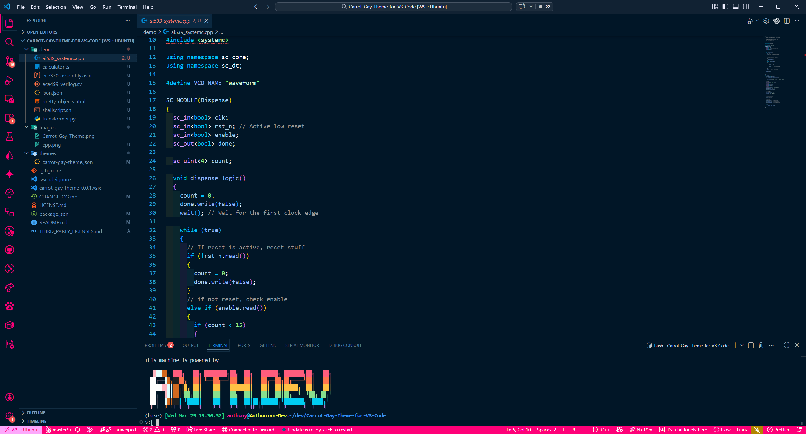
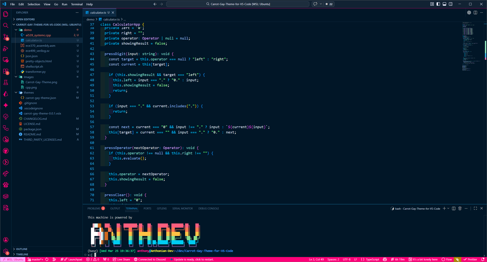
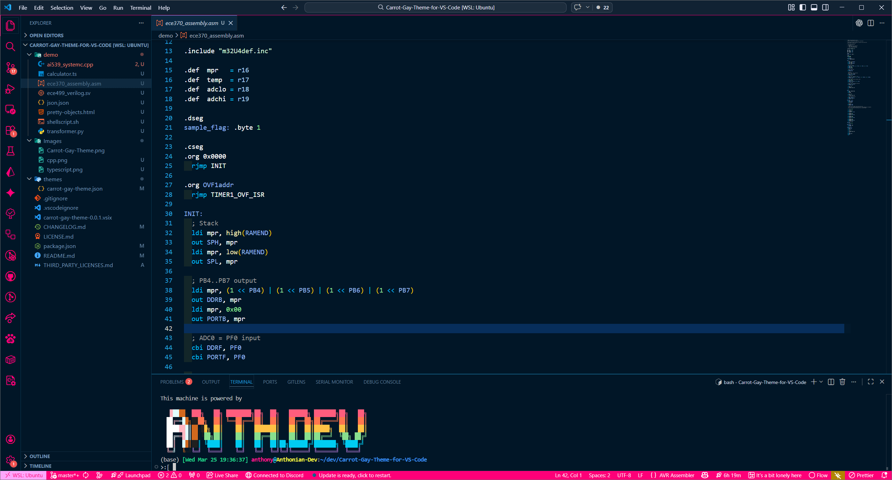
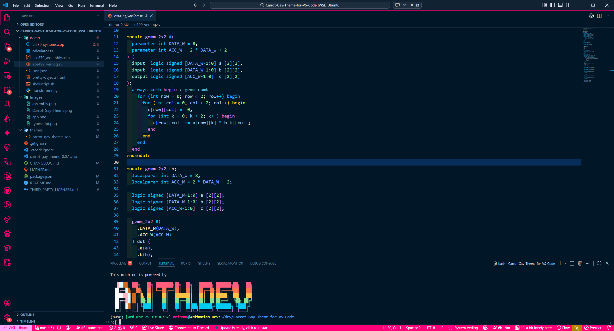
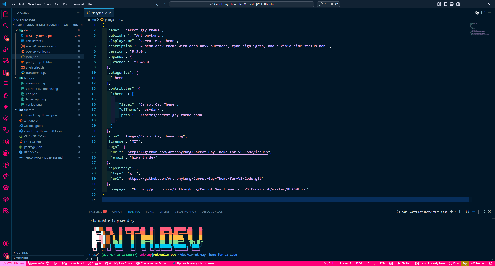
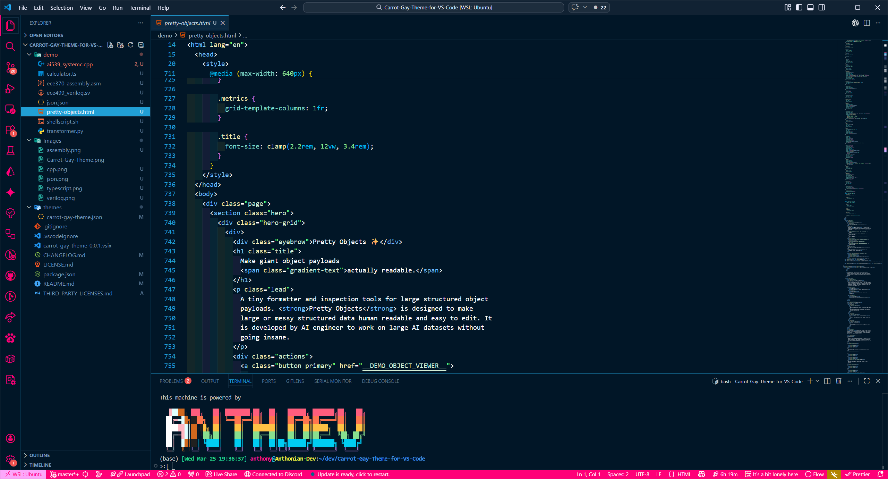
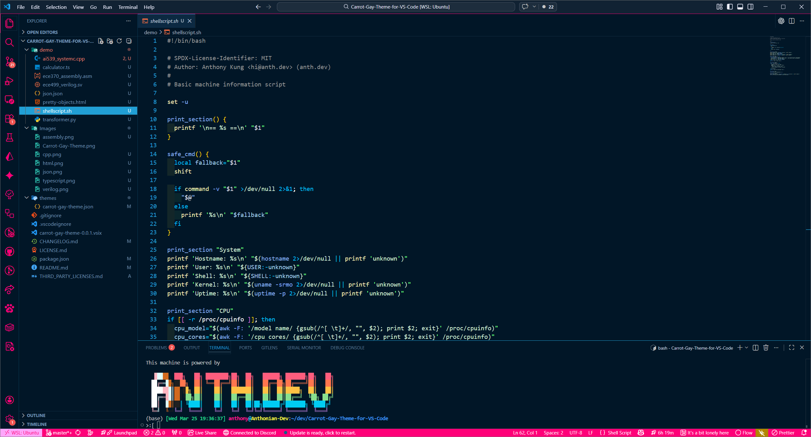
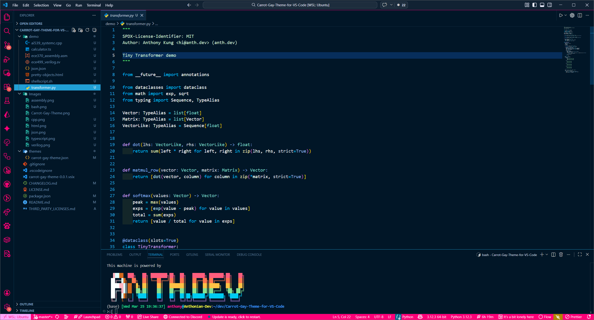

# Carrot Gay Theme for VS Code

  

  A neon dark theme with deep navy surfaces, cyan highlights, mint strings, and a vivid pink status bar.

It is basically Winter is Coming Theme with a slight hint of pink, color described by carrot as "gay" thus the name, with deep navy surfaces, bright cyan accents, mint strings, and a vivid pink status bar.

> This extension does NOT transmit any data over the network. No telemetry, analytics, crash reports, usage tracking, data collection of any kind is ever collected. You should NEVER trust the words of some random extension, please verify the source code yourself as best practices.

## Why This Theme

- Deep navy editor and panel surfaces
- Bright cyan and sky-blue accents for focus states
- Mint and pale green strings
- Lavender and pink highlights across syntax and UI
- A vivid pink status bar to keep the theme recognizable at a glance

## Screenshots

### C++

  

### TypeScript

  

### Assembly

  

### Verilog

  

### JSON

  

### HTML

  

### Bash

  

### Python

  

## Install

### VS Code Marketplace

Marketplace: https://marketplace.visualstudio.com/items?itemName=Anthonykung.carrot-gay-theme

1. Open Extensions in VS Code.
2. Search for `Carrot Gay Theme`.
3. Click Install.
4. Run `Preferences: Color Theme` and select `Carrot Gay Theme`.

### Manual Install

Repository: https://github.com/Anthonykung/Carrot-Gay-Theme-for-VS-Code

1. Clone this repository into your `~/.vscode/extensions` directory.
2. Restart VS Code if it is already open.
3. Run `Preferences: Color Theme` and select `Carrot Gay Theme`.

## Credits

This theme is derived from the Winter is Coming Theme by JohnPapa.net, LLC, licensed under the MIT License.

Modifications and additional work were made by Anthony Kung.

Created with 💖 by [Anthony Kung](https://anth.dev)
